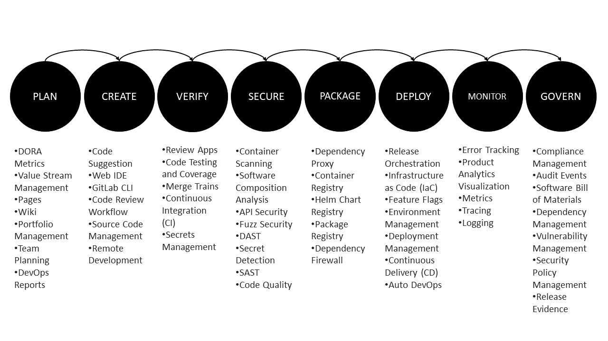

## Project Planning and Development

<!-- THIS IS INFO FOR PLANNING PROCESS -->

<!--
`PLAN`

- DORA Metrics
- Value Stream Management
- Pages
- Wiki
- Portfolio Management
- Team Planning
- DevOps Reports

`CREATE`

- Code Suggestion
- Web IDE
- GitLab CLI
- Code Review Workflow
- Source Code Management
- Remote Development

`VERIFY`

- Review Apps
- Code Testing and Coverage
- Merge Trains
- Continuous Integration (CI)
- Secrets Management

`SECURE`

- Container Scanning
- Software Composition Analysis
- API Security
- Fuzz Security
- DAST
- Secret Detection
- SAST
- Code Quality

`PACKAGE`

- Dependency Proxy
- Container Registry
- HeIm Chart Registry
- Package Registry
- Dependency Firewall

`DEPLOY`

- Release Orchestration
- Infrastructure as Code (IaC)
- Feature Flags
- Environment Management
- Deployment Management
- Continuous Delivery (CD)
- Auto DevOps

`MONITOR`

- Error Tracking
- Product Analytics Visualization
- Metrics
- Tracing
- Logging

`GOVERN`

- Compliance Management
- Audit Events
- Software Bill of Materials
- Dependency Management
- Vulnerability Management
- Security Policy Management
- Release Evidence
-->

## Introduction

"Fintrek" is a comprehensive personal finance web application designed to empower individuals in managing their financial health with ease and efficiency. With Fintrek, users can effortlessly track their income, monitor expenses, plan budgets, and gain valuable insights through intuitive analytics tools.

**Key Features:**

1. **Income Tracking:** Fintrek enables users to log their various sources of income, including salaries, bonuses, investments, and other earnings, providing a clear overview of their financial inflows.

2. **Expense Management:** Users can conveniently categorize and track their expenses, whether it's for groceries, bills, entertainment, or any other expenditures. Fintrek's intuitive interface makes it easy to record expenses and stay within budget.

3. **Budget Planning:** Fintrek offers robust budgeting features that empower users to set financial goals, allocate funds to different categories, and track their progress over time. Customizable budget plans help users manage their spending and save for future endeavors.

4. **Analytics and Insights:** Leveraging the power of data analytics, Fintrek provides users with actionable insights into their financial habits and trends. Interactive charts and reports offer a visual representation of income, expenses, savings, and investment performance, enabling users to make informed decisions about their finances.

5. **Secure Data Storage:** Fintrek prioritizes the security and privacy of user data. Utilizing industry-leading encryption standards and AWS services, such as Amazon RDS and Amazon Cognito, Fintrek ensures that sensitive financial information remains safe and confidential.

6. **User-Friendly Interface:** With a sleek and intuitive user interface, Fintrek offers a seamless user experience across devices. Whether accessing the platform on desktop or mobile devices, users can easily navigate through features and manage their finances on the go.

7. **Scalability and Reliability:** Built on AWS infrastructure, Fintrek ensures scalability and reliability, allowing the platform to handle increasing user demands without compromising performance. This ensures a smooth and uninterrupted experience for users, even during peak usage periods.

Fintrek is more than just a financial tracking tool; it's a trusted companion that empowers users to take control of their financial journey, make informed decisions, and achieve their long-term financial goals with confidence.

*Note: These info I took during GitLab Event held on Element Hotel, Kuala Lumpur. So, this is personal project, I'll testing out on using GitLab and GitHub, much faster to differentiate between these two services.*

## Project Deployment Plan
1. **Planning and Design:**
   - Define the features you want in your app: income tracking, expense tracking, budget planning, analytics, etc.
   - Sketch out the user interface and experience.
   - Plan the database structure. Since you want to use SQL, decide on the tables you'll need for storing user data.

2. **Setting Up Your GitHub Pages:**
   - Create a new repository on GitHub with a username.github.io name.
   - You can use this repository to host your web app.

3. **Choose Your Tech Stack:**
   - Since you want to use SQL, you'll need a backend language/framework to handle server-side logic and interact with the database. Popular choices include Node.js with Express, Django (Python), or Flask (Python).
   - For the frontend, you can use HTML, CSS, and JavaScript. You might also consider using a frontend framework like React or Vue.js for a more interactive user interface.

4. **Database Setup:**
   - Set up a SQL database. You can use MySQL, PostgreSQL, SQLite, or any other SQL database that you're comfortable with.
   - Design your database schema based on the data you'll be storing (users, income, expenses, etc.).

5. **Backend Development:**
   - Set up your backend server using your chosen technology.
   - Implement endpoints/routes for handling user authentication, data CRUD operations (Create, Read, Update, Delete), and analytics.

6. **Frontend Development:**
   - Create the UI for your web app using HTML, CSS, and JavaScript.
   - Integrate with your backend to fetch and display user data.

7. **Analytics:**
   - Implement analytics features using libraries like Google Analytics or charting libraries for visualizing data.

8. **Testing and Deployment:**
   - Test your app thoroughly to ensure it works as expected.
   - Deploy your app to your GitHub Pages repository or consider using a hosting service like Heroku for the backend and GitHub Pages for the frontend.

9. **Continuous Improvement:**
   - Gather feedback from users and iterate on your app to improve its functionality and user experience over time.

## Project Integration with AWS

1. **Hosting with Amazon S3 and CloudFront:**
   - Host your static website files (HTML, CSS, JavaScript) on Amazon S3.
   - Use Amazon CloudFront for content delivery and caching to improve website performance.

2. **Database with Amazon RDS or DynamoDB:**
   - For SQL databases, you can use Amazon RDS (Relational Database Service) with MySQL, PostgreSQL, or another compatible engine.
   - Alternatively, consider using Amazon DynamoDB for a NoSQL database option, especially if you need high scalability and flexibility.

3. **Authentication and Authorization with Amazon Cognito:**
   - Use Amazon Cognito to handle user authentication and authorization.
   - Cognito provides features like user pools for managing user identities and federated identities for integrating with social identity providers like Google and Facebook.

4. **Serverless Backend with AWS Lambda and API Gateway:**
   - Implement serverless functions using AWS Lambda for handling backend logic.
   - Use Amazon API Gateway to create RESTful APIs for your frontend to communicate with your backend services.

5. **Storage with Amazon S3 or Amazon EBS:**
   - Store user-uploaded files, such as receipts or documents, in Amazon S3.
   - If you need block storage for your backend, consider using Amazon EBS (Elastic Block Store).

6. **Analytics with Amazon Redshift or Amazon Athena:**
   - Use Amazon Redshift for data warehousing and analytics if you require complex analytics queries and large-scale data processing.
   - Alternatively, Amazon Athena can be used for querying data directly from Amazon S3 using SQL.

7. **Monitoring and Logging with Amazon CloudWatch:**
   - Set up monitoring and logging for your application using Amazon CloudWatch.
   - Monitor metrics, set up alarms, and collect logs to ensure your app is running smoothly.

8. **Security with AWS Identity and Access Management (IAM):**
   - Follow security best practices and configure IAM roles and policies to control access to AWS resources.
   - Enable encryption for sensitive data at rest and in transit using AWS Key Management Service (KMS) and SSL/TLS.

9. **Deployment with AWS CodePipeline and AWS CodeDeploy:**
   - Set up a CI/CD pipeline using AWS CodePipeline to automate your deployment process.
   - Use AWS CodeDeploy for deploying updates to your application.

Integrating these AWS services will provide scalability, reliability, and security for your personal finance web app. Make sure to consider the cost implications and optimize your usage to stay within budget.

